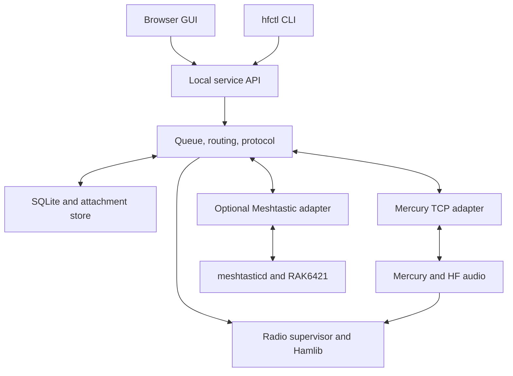

# Mercury HF Link — Project Plan

Status: design proposal; no application has been implemented or radio tested.
Prepared: 2026-09-23.

## 1. Goal and initial deployment

Build a continuously running, two-station HF messaging service using Rhizomatica Mercury v2 as the modem and ARQ transport. Provide an email-like persistent mailbox, IRC-style conversations, small attachments, a graphical client, a command-line client, and an optional bidirectional Meshtastic gateway. Operation must not depend on internet access.

| Station | Computer | HF radio | Control | Audio | Meshtastic |
|---|---|---|---|---|---|
| A | Raspberry Pi 4 or 5, 64-bit Raspberry Pi OS Bookworm | (tr)uSDX, firmware 2.00u or newer | USB CAT through Hamlib | CM108/CM119 USB sound adapter plus analog cables | Optional RAK6421 WisMesh Pi HAT with a compatible LoRa module; meshtasticd |
| B | Windows PC | Yaesu FTDX10 | USB CAT through Hamlib | Radio's USB audio interface | Disabled initially; optional remote Pi gateway or supported USB Meshtastic node later |
| Additional client | Windows or Linux computer | None required | Connects to station service API | None | Through station API |

Use the working project name **Mercury HF Link**, daemon `hf-linkd`, and CLI `hfctl`. Callsigns are supplied during configuration; examples such as `CALL_A` and `CALL_B` are placeholders, never default transmit identities.

Assume U.S. amateur operation for the initial radio profile. Require actual country, license privileges, callsigns, radio band coverage, and antenna configuration before enabling transmission. The software must distinguish a service that is always running from permission to transmit automatically.

## 2. Decisions that shape the project

1. **Use Mercury as a separate modem process.** Integrate its documented TCP interface; do not fork its waveform or rewrite ARQ for the first release.
2. **One durable service owns message state.** GUI, CLI, and Meshtastic submissions use the same validation, routing, permissions, and queue.
3. **One radio supervisor arbitrates CAT and PTT.** No competing applications may independently change frequency or key the radio.
4. **Encryption is transport-policy dependent.** Include authenticated remote encryption negotiation in the protocol, but prohibit encrypted HF payloads in the U.S. amateur profile. Enable encrypted operation only for wired simulations or a separately configured service where authorization permits it.
5. **Use a finite, shared channel plan.** A band selector chooses reviewed channels within the intersection of both stations' capabilities and privileges. It never means “transmit anywhere in this band.”
6. **Implement frequency agility, not spread-spectrum hopping.** Change channels between sessions after confirmation, or use a previously agreed rendezvous schedule when coordination fails.
7. **Treat the (tr)uSDX/Mercury RF combination as an early feasibility gate.** CAT compatibility does not establish acceptable OFDM distortion, occupied bandwidth, switching time, or sustained duty cycle.

## 3. Verified upstream baseline and limitations

The GitHub default branch inspected was `mercuryv2`; the observed head was `d08e03769a1d99f35d8bc3d46a46665a010bf398`. Pin and recheck this commit during implementation rather than following a moving branch. Sources [S1–S4] describe the baseline.

| Interface or behavior | Observed upstream support | Project consequence |
|---|---|---|
| ARQ control | TCP 8300 by default; CR-terminated commands | Build an asynchronous command/event parser |
| ARQ application data | TCP 8301 by default; raw byte stream | Add our own bounded message framing |
| TNC commands | `MYCALL`, `LISTEN ON/OFF`, `CONNECT`, `DISCONNECT`, `ABORT`, `BUFFER`, `SN`, `BITRATE`, bandwidth tokens | Adapter startup, connection lifecycle, backpressure, diagnostics |
| Activity reports | `BUSY ON/OFF`, `PENDING`, `PTT ON/OFF`, connection events | Feed scheduling and scan holds |
| Busy detector | Optional, disabled by default; does not itself inhibit TX | Implement and test transmit admission locally |
| Platforms | Linux/Raspberry Pi and Windows supported | Package a pinned modem on both ends |
| Debian packages | README currently documents Debian 13/Trixie packages | Build/test on Bookworm; do not mix Trixie packages into Bookworm |
| Bandwidth | `BW500`, `BW2300`, `BW2750` tokens | Validate actual waveform spectrum, not just token names |

The README, TNC reference, and mode reference are not completely consistent about the ceiling of the wideband adaptation ladder. Treat executable behavior and source at the pinned commit as authoritative; add a compatibility test before enabling wide modes. The modem's reported `REGISTERED` event is not proof of an operator's license or identity.

Mercury performs radio-link retransmission. It does not establish that the receiving application has saved a message to disk. Our application must provide its own durable receipts and deduplication.

## 4. Architecture

At each HF endpoint, the same daemon runs above a local Mercury process. The optional mesh adapter exists only where enabled.



The two Mercury instances exchange data over HF. The station APIs are local/LAN services; there is no requirement for an IP connection between the sites.

### Proposed components

| Component | Responsibility |
|---|---|
| `hf-linkd` | Async Python service, scheduler, session coordinator, persistent message state |
| `hfctl` | Python CLI using the same API as the GUI; interactive chat and scriptable JSON output |
| Web GUI | Bundled TypeScript/HTML/CSS assets, usable offline in Windows/Linux browsers |
| API | FastAPI-style REST endpoints plus WebSocket event feed; dependency versions pinned after compatibility testing |
| Storage | SQLite WAL, transactional outbox/inbox, attachment spool, schema migrations |
| Mercury adapter | Two TCP sockets, CR parsing, event correlation, reconnects and bounded buffering |
| Radio supervisor | Hamlib-backed CAT/PTT arbitration, policy enforcement, watchdog, channel changes |
| Meshtastic adapter | Official Python API; TCP to local meshtasticd for the Pi HAT |
| Security/policy | Peer authentication, replay protection, crypto negotiation, band and traffic rules |

A browser is the initial cross-platform GUI client. Provide Windows and Linux launchers/installers; the service must remain running when its window is closed. A native desktop wrapper is optional after the service and hardware path are proven, not a prerequisite for messaging.

The planned source layout is a conventional repository with `src/hf_link/` modules for `api`, `storage`, `protocol`, `mercury`, `radio`, `scheduler`, `security`, and `meshtastic`; `ui/` for the GUI; `profiles/` for station/channel policies; `packaging/linux/` and `packaging/windows/`; and `tests/` for protocol, simulation, and hardware acceptance. This document is the initial folder content, not an implemented skeleton.

## 5. Hardware and Hamlib integration

### Station A: Raspberry Pi and (tr)uSDX

- USB from the Pi to the radio provides CAT. The manufacturer's manual specifies TS-480-compatible CAT at 115200 baud for firmware 2.00t and later [S5]. Prefer Hamlib's dedicated `(tr)uSDX` backend when present; upstream defines it in `rigs/kenwood/ts480.c` [S6]. Discover the installed model number with `rigctl -l`; do not guess it.
- USB from the Pi to the CM108/CM119 adapter provides audio. Adapter playback goes through a correctly attenuated, DC-blocked interface to the radio microphone input. Radio audio output goes through appropriate attenuation/DC blocking to the adapter capture input. Validate the actual jack pinouts and microphone bias before wiring.
- Use CAT PTT through Hamlib. A generic audio stick is not automatically a ready-wired GPIO PTT interface, even if its chip supports GPIO.
- Do not run a USB serial audio-streaming helper alongside CAT; this plan deliberately uses the separate audio adapter. USB CAT plus a sound adapter still requires the analog audio cables.
- Use proper external radio power, suitable antenna/tuner, and common-mode/RF suppression as required by the measured setup. Do not assume the USB control cable provides operating RF power.
- Use stable audio identities and `/dev/serial/by-id` where available, with an explicit configured fallback for adapters lacking unique serial numbers.
- Verify the actual low-band/classic/high-band filter board. Enable only installed and tested bands; software cannot add missing RF filters.

Start with Mercury's narrow bandwidth profile and conservative audio drive. Measure spectral cleanliness and delivery in both directions. OFDM envelope behavior and high peak-to-average requirements may constrain the (tr)uSDX; full-rate Mercury operation is not promised. If no supported mode meets the RF/link gate, retain the architecture and report the need for a different radio or transport explicitly.

### Station B: Windows and FTDX10

Use the radio's USB-B connection for CAT and USB audio. Install the Yaesu-specified virtual COM driver, identify the CAT port, select the USB audio input/output, and configure data USB mode with the correct rear/USB audio source [S7]. Match CAT baud rates at both ends. Disable speech processing and other voice-oriented audio shaping for data; set drive using measurements, not a nominal microphone percentage. Ensure Windows notification audio is not routed to the transmitter.

Use the dedicated FTDX10 Hamlib backend. Its numeric identifier must come from the installed Hamlib build [S6]. The exact radio menu values and power limits belong in a hardware commissioning record after testing.

### Sole radio ownership and PTT behavior

`rigctld` exclusively owns the physical CAT serial port. The project radio supervisor exposes a limited Hamlib-compatible NET rigctl endpoint to Mercury and uses a private local connection to rigctld. The supervisor also handles frequency/mode requests from the scheduler. Implement only the required NET rigctl operations first, and verify Mercury interoperability in the initial spike [S8].

Mercury requests PTT through this supervisor. The supervisor rejects keying while retuning, faulted, disarmed, or outside the approved profile. Its decision must be synchronous: a rejected key must cause Mercury to suppress the associated audio/transmission. If Mercury does not propagate backend PTT failures correctly, patch that small integration point and test it before relying on the interlock.

Busy-channel policy distinguishes starting a new connection from replying to the current peer. Blindly rejecting every PTT request whenever a peer signal was recently heard would break ARQ acknowledgements. Allow bounded response opportunities for an established session; delay new calls on an occupied channel, and terminate/suspend if sustained foreign activity makes continuing inappropriate.

Always verify frequency and mode after a CAT change. Prevent retuning until PTT is confirmed off and the modem is idle. Manual VFO changes revoke transmit permission until reconciled. Include a maximum TX burst watchdog, graceful shutdown unkey, and a recovery action for stuck PTT. Software cannot guarantee unkey after a complete host or CAT failure; continuous deployments need a tested radio timeout or external fail-safe if that failure mode matters.

## 6. Message model and user experience

The main view is an IRC-style channel timeline with UTC/local time, configured user identity, text, attachment indicator, and delivery status. Also provide Inbox, Outbox, Sent, Failed, Drafts, and searchable archived threads. An optional subject groups related messages without changing the chat presentation.

Example rendered messages:

> 14:03 CALL_A: Water level checked; all clear.  [delivered]
>
> 14:05 CALL_B: Copy. Attached the updated list.  [list.txt · 3.2 KiB]
>
> 14:06 mesh:!a1b2c3d4 via CALL_A: Arrived at the gate.

The configured callsign is a presentation identity and station identifier; authentication comes from the provisioned peer credentials. Store station callsign, author identity, authenticated peer ID, and Meshtastic node ID separately. Never silently turn an unlicensed mesh user's chosen nickname into a ham callsign.

Each message has a random unique message ID, conversation ID, source/destination station, author ID, UTC timestamp, content type, body or attachment manifest, route provenance, expiration, and receipt state. Keep arrival order separately because offline clocks may be inaccurate.

Delivery states: `draft → queued → connecting → transmitting → modem-acknowledged → peer-stored`, with separate `read` and `mesh-forwarded` states. Display “delivered” only after `peer-stored`. A missing receipt means unconfirmed, not necessarily lost; retransmission must not create another visible message.

### Small files

Initial limits: 4 KiB text bodies; 32 KiB default attachment limit; locally configurable hard ceiling of 128 KiB. Begin with plain text, CSV, JSON, and small images. Arbitrary opaque/encrypted files are not admitted to the amateur-radio queue merely because they have an allowed extension.

Use a manifest containing sanitized filename, MIME type, byte length, SHA-256, and chunk parameters. Negotiate chunks of 256–1024 bytes, default 512. Persist a received-chunk bitmap; resume after reconnect and acknowledge completion only after length/hash validation and durable storage. Never execute or automatically open received files. Bound expanded sizes and decompression ratios if compression is later introduced.

Show estimates from measured recent goodput. For planning only, 32 KiB takes approximately 109 minutes at 5 bytes/s, 22 minutes at 25 bytes/s, or 5.5 minutes at 100 bytes/s, before extra startup/retries. These are arithmetic scenarios, not measured performance of these radios. Text, acknowledgements, and control traffic preempt attachment chunks.

“Email-like” means persistent asynchronous mailboxes. SMTP, IMAP, internet mail delivery, and Winlink interoperability are outside the first release.

## 7. Application protocol above Mercury

Define and publish protocol `HFML/1`. Use a fixed magic/version prefix, a bounded length field, and canonical CBOR envelopes. The Mercury data socket is a stream; TCP reads and Mercury frames are not application message boundaries. Reject malformed, oversized, and unsupported frames before allocation.

Frame families:

| Family | Purpose |
|---|---|
| `HELLO`, `AUTH`, `CAPABILITIES` | Version, peer challenge/response, resource limits and profile hashes |
| `TEXT`, `STORED`, `READ` | Messaging and durable receipts |
| `FILE_OFFER`, `FILE_ACCEPT`, `FILE_CHUNK`, `FILE_STATE`, `FILE_COMPLETE` | Consent, bounded transfer and resumability |
| `CONTROL_PROPOSE`, `CONTROL_READY`, `CONTROL_COMMIT`, `CONTROL_RESULT` | Typed changes to crypto, channels and authorized features |
| `PLAN_OFFER`, `PLAN_ACCEPT`, `RENDEZVOUS_HELLO` | Shared channel/recovery plan versioning |
| `ERROR`, `CANCEL` | Explicit failure, cancellation and unsupported-feature reporting |

Application receipts reference message IDs and are idempotent. Save incoming messages and receipt intent in the same transaction; acknowledge only after commit. Use at-least-once transport plus unique-ID deduplication to produce one visible message. A crash after sending a receipt must not erase the underlying message.

Maintain priority queues: critical control/receipts, interactive text, mesh text, attachment chunks. Bound bytes already submitted to Mercury so a long file cannot bury a frequency-change request. Use `BUFFER` for backpressure, but do not equate zero buffered bytes with a durable application receipt.

Persist queued messages across restarts, retry with bounded backoff and jitter, and report expiration/failure to the sender. Use deterministic caller preference to reduce simultaneous-connect collisions; the nonpreferred peer may originate after its defer interval. Do not keep an idle HF session keyed or endlessly exchanging keepalives just because the daemon is running.

## 8. Authentication and remotely toggled encryption

### Required policy split

47 CFR 97.113(a)(4) prohibits messages encoded to obscure their meaning, subject to its exceptions. An ordinary encrypted chat/file service is not an amateur-HF exception [S9]. Therefore:

- `us_amateur`: publicly decodable message bodies and commands; no encrypted attachments or tunneled encrypted Meshtastic payloads.
- `wired_lab`: encryption tests over simulated/wired transport, with RF transmission disabled.
- `authorized_private`: encrypted payload mode only after a locally installed policy describes the actual service authorization, frequencies, equipment, and operating constraints. This is not a checkbox that legalizes transmission on amateur frequencies.

Use readable command fields plus authentication tags to prevent unauthorized changes without hiding the command. This distinction is a design approach, not a claim that every authentication/telecommand arrangement is permitted in every jurisdiction. Confirm the applicable control arrangement before deployment. Local disk encryption and HTTPS to a station's LAN GUI are separate from encryption transmitted over HF.

### Command interface

Proposed CLI forms, not commands implemented by this deliverable:

```text
hfctl crypto propose --peer CALL_B --mode encrypted --key-id link-2026-01
hfctl crypto propose --peer CALL_B --mode plaintext --key-id link-2026-01
hfctl crypto status
```

Expose equivalent typed text commands to the administrative parser, such as `/crypto encrypted CALL_B key=link-2026-01`. Ordinary chat strings must never execute administrative commands merely by matching a prefix. CLI/UI routing creates a distinct authenticated control envelope; mesh-originated control is disabled initially.

Provision a separate random 256-bit PSK per peer pair out of band. Store secrets in OS-protected storage or a restrictive local secret file, not messages, logs, URLs, example configs, or shell arguments. A key ID is public; the key itself never crosses HF.

### Negotiation and cryptographic requirements

1. Exchange fresh challenges and authenticate both peers using HMAC-SHA-256 over canonical fields: protocol version, operation, peer IDs, request ID, mode, key ID, session challenges, monotonic control sequence, expiry, and policy hash.
2. The receiving service validates authentication, replay state, requested capability, and its own local policy. A valid PSK cannot bypass local restrictions. In `us_amateur`, return `POLICY_DENIED` for encrypted mode.
3. The responder persists `READY`. The initiator sends an authenticated `COMMIT` with a new crypto epoch and activation boundary. Both drain/close the current application session and reconnect to negotiate the committed epoch explicitly.
4. While commit status is uncertain, hold user payloads. Reconcile the pending transaction over the authenticated control plane on reconnect. Never silently send a message marked encryption-required as plaintext.
5. Derive separate control, transmit, and receive keys using HKDF with the PSK, fresh session nonces, peer identities, and direction labels. Use a vetted ChaCha20-Poly1305 implementation for authorized encrypted payloads; never invent a cipher.
6. Guarantee unique AEAD nonces per key, bind headers as associated data, and start new session keys after reconnect/restart. Persist control replay counters and revoke/rotate keys locally. PSK-only key establishment provides no forward secrecy; document that limitation.

Both encryption enable and disable commands require authorization. Encryption-required queued messages remain held after encryption is disabled until the sender explicitly changes their policy. Test dropped commits, replay after restart, mismatched keys, invalid tags, downgrade attempts, and duplicated commands. Remote administrative commands can invoke only defined actions, never shell execution or arbitrary configuration writes.

## 9. Meshtastic integration

The RAK6421 is a Pi HAT integration board; it needs a supported LoRa module and antenna. RAK documents RAK13300/RAK13302 options and Linux `meshtasticd` support [S10]. Confirm the purchased package actually includes the radio module. Use one tested module initially; validate RF region/power independently of HF settings.

The bridge connects through the official Meshtastic Python `TCPInterface` to the Pi's meshtasticd API, normally local TCP 4403 after configuration verification. Use documented receive subscriptions and `sendText` for standard text compatibility [S11]. Do not treat the HAT as a generic USB UART node, and do not expose the raw device API to the internet.

The toggle applies to the adapter, not the core service. With `mesh.enabled=false`, it opens no mesh connection and forwards nothing. When enabled, allow independent `hf_to_mesh` and `mesh_to_hf` switches with mapped channel IDs and destination allowlists.

### Routing and user commands

- HF → mesh: only messages explicitly addressed to an allowed mesh channel/node are rendered as `CALL_B: message` and sent through the local module. Regular HF mail does not automatically become a public mesh broadcast.
- Mesh → HF: accept only allowlisted nodes/channels and explicit commands such as `HF SEND CALL_B text`, `HF INBOX`, `HF READ short-id`, and `HF STATUS`. Reply with concise queue/receipt status.
- `HF INBOX` and `HF READ` are scoped to the bound node identity; they cannot disclose another user's mail. Treat shared-channel names/node IDs as insufficient for high-privilege administration. Prefer direct replies and avoid private-inbox commands on a public shared channel.
- Preserve message ID, source transport, original mesh node ID, packet ID, bridge ID, route trace, and bridge TTL in the application's routing state. Do not forward a message back to its ingress route. Maintain a persistent deduplication window and suppress echoed packets/content.
- Start with a conservative 160-byte rendered text budget per mesh packet, including callsign/prefix. Negotiate/validate the actual firmware limit; count UTF-8 bytes. Limit splits to three numbered fragments and reject larger posts with a useful error.
- Queue and rate-limit mesh transmissions. Distinguish node ACK, gateway acceptance, HF receipt, and user read state. A broadcast has no reliable all-recipient delivery confirmation.
- Files remain on the HF endpoints in version 1. Mesh clients see file metadata and a small text preview where appropriate; bulk file forwarding over LoRa is deferred.

Meshtastic channel encryption may be used on its separately authorized LoRa service. The bridge terminates that encryption and sends only eligible, explicitly opted-in plaintext across amateur HF. Explain that HF forwarding makes the content publicly decodable. Do not forward opaque encrypted packets or treat mesh encryption as end-to-end protection across an amateur HF bridge.

Check third-party and international message restrictions before admitting mesh-originated amateur traffic. A packet carrying a callsign does not automatically make every sender's content eligible for amateur relay [S12]. Default deployment is a private allowlisted two-station U.S. test, not an open public gateway.

## 10. Band selection, frequency policy, and coexistence

FT8 is a digital mode using activity frequencies within amateur bands, not an entire band to avoid. Exclude occupied RF ranges around FT8/FT4/JS8/WSPR and other protected or established activity, plus local nets and known packet channels. Combine exclusions with listen-before-transmit: a frequency list can never guarantee an unused channel.

Maintain versioned country/region/license/control-mode profiles. ARRL band plans are voluntary coordination guidance; FCC permissions and emission restrictions are legal constraints [S13–S15]. Both apply to the selection algorithm. Profiles need source links, review dates, and an operator approval record.

### Initial U.S. automatic-data planning envelope

These are **segment boundaries, not transmit dial frequencies**. They come from 97.221(b); full permitted emissions, identification, licensing, and interference duties still apply [S14].

| Band | Segment to consider for automatic data, MHz | Initial product status |
|---|---|---|
| 80 m | 3.585–3.600 | Candidate if both radios/antennas support it |
| 40 m | 7.100–7.105 | Candidate; only 5 kHz total, so few independent wide channels |
| 30 m | 10.140–10.150 | Optional after hardware/privilege/exclusion review |
| 20 m | 14.0950–14.0995 and 14.1005–14.112 | Candidate; preserve beacon gap and margins |
| 17 m | 18.105–18.110 | Disabled unless (tr)uSDX board supports it |
| 15 m | 21.090–21.100 | Disabled unless hardware/antennas support it |
| 12 m | 24.925–24.930 | Disabled unless hardware/antennas support it |
| 10 m | 28.120–28.189 | Optional after hardware, emission and local-plan review |

Exclude 60 m from the initial release because its separate channel/segment and control restrictions need a dedicated profile. Other bands are extensible, not automatically enabled.

Outside the listed automatic segments, 97.221(c) has additional conditions, including responding to a locally/remotely controlled station and a 500 Hz occupied-bandwidth limit. Do not infer permission for two autonomous endpoints to originate anywhere just because `BW500` is selected. Default automatic operation stays inside reviewed 97.221(b) segments. Relevant HF data rules include a 2.8 kHz limit under 97.307(f)(3), subject to the particular emission/band provisions [S15].

### Converting channels into safe dial settings

Store `dial_hz`, `sideband`, measured `audio_low_hz`/`audio_high_hz`, allowed Mercury bandwidth/modes, frequency-error margin, and permitted RF interval. For USB, occupied RF is approximately `[dial + audio_low, dial + audio_high]`; for LSB it is `[dial − audio_high, dial − audio_low]`. Validate the whole interval plus measurement margin against limits and exclusions.

Use USB for the planned data link on all enabled bands; the FTDX10 uses its corresponding data-USB mode. Confirm the exact audio centering and radio filtering for the pinned Mercury build. A synthetic geometry test can use 7.101000 MHz dial and measured audio from 300–2700 Hz, yielding 7.101300–7.103700 MHz before margins. That is an arithmetic example, not an approved operating frequency or an asserted Mercury spectrum.

The initial installed configuration has no armed transmit channels until commissioning fills this table from actual measurements. GUI band selection displays only the shared, approved channel intersection. Cross-band moves additionally require the installed filters, antenna/tuner state, both operators' permissions, and both stations' acceptance.

For testing the exclusion engine, use conventional FT8 dial examples 3.573, 7.074, and 14.074 MHz with an explicit conservative test audio span and guard margin. Production exclusions must be maintained from current mode defaults and local coordination; these three examples are not a complete avoidance list.

## 11. Interference response and coordinated channel changes

Use recent SNR, application goodput, time since durable progress, connection failures, and calibrated channel occupancy. Low SNR alone may mean propagation fading rather than interference. Mercury's detector can misclassify filtered noise and sustained wide signals [S2]; it is evidence, not a proof that a channel is free.

Initially let Mercury adapt its rate, retry conservatively, and apply a hop cooldown. Suggested lab starting values: evaluate over 60–120 seconds, consider recovery after 180 seconds without authenticated progress, and suppress another discretionary hop for 5 minutes. These are tunable proposal values, not guaranteed timing constants.

### A. Link still usable: confirmed handoff

1. Elect one coordinator from the provisioned station IDs; the other may request a change. This prevents simultaneous independent proposals.
2. Pause new user-data admission and finish the current bounded chunk. Propose an allowlisted target channel with transaction ID, plan hash, reason, future UTC activation time, and expiry. Set the activation sufficiently far ahead to complete the exchange at measured robust-mode goodput; start lab evaluation at 120 seconds or more.
3. The peer validates radio/antenna/policy capability and sends authenticated `READY`. When manual approval is configured, the operator accepts in the GUI/CLI before `READY`.
4. Send `COMMIT`; peer persists it and sends `COMMIT_ACK`. Neither treats an unacknowledged proposal as a coordinated switch. No finite exchange eliminates the possibility of losing the last acknowledgement, so both retain the same recovery plan.
5. Drain/close the Mercury session with a deadline, confirm PTT off, inhibit transmit, change frequency/mode using Hamlib, verify readback, wait for settling, then assess occupancy on the target channel.
6. Reconnect during the agreed window, confirm channel/transaction ID, and resume by message ID/chunk bitmap. If target is busy, fail closed and enter the agreed rendezvous procedure; do not independently choose another target.

### B. Link unusable: pre-agreed rendezvous

Before loss, both endpoints must hold the same locally accepted recovery-plan hash. It contains ordered allowed channels, shared UTC epoch, slot duration, guards, station caller/listener roles, maximum attempts, home channel, and cross-band permissions.

Derive the recovery slot from absolute UTC, not each node's local “time since failure.” Start with 180-second slots for simulation; set final dwell/guards using measured Mercury connection time and the configured retry budget. Bound that budget to fit inside a slot. After settling and clear-channel assessment, only the nominated caller originates; the listener waits. A valid pending/connect exchange freezes scanning for a bounded acquisition period, and authenticated progress locks both stations on the channel. Unauthenticated noise never holds a scan indefinitely.

A node that loses contact may enter scanning before its peer. With one radio, that cannot guarantee immediate rendezvous. The peer must also enter recovery on its bounded no-progress timeout, after which the common UTC schedule brings them together. Missing final commit messages are handled by this same mechanism.

Use local RTC/GNSS or measured offline clock drift to maintain adequate time confidence. If uncertainty exceeds the slot guard, fall back to the agreed home frequency in receive-first mode and require resynchronization/operator intervention. A rebooted station loads the persisted plan and clock-confidence state; it does not transmit arbitrary search calls.

For a persistently occupied slot, remain silent through it and continue on the shared schedule. Reaching an attempt/time limit returns both endpoints to the agreed home receive state and raises an alert. If every approved channel is busy, hold traffic. No random hopping, secret channel generation, or attempts to defeat another transmitter are part of this feature.

## 12. GUI, CLI, and API scope

The GUI offers channel timelines, mailbox folders, a composer, attachment upload, peers, queue status, retry/cancel, callsign configuration, radio status, approved band/channel selection, mesh toggle/routing, and a clear transmit inhibit control. Show crypto state accurately: “HF plaintext” for amateur operation, with denied encrypted-mode requests explained.

Proposed CLI examples:

```text
hfctl status --json
hfctl send --to CALL_B --channel operations "Arrived safely"
hfctl chat --channel operations
hfctl inbox --unread
hfctl file send --to CALL_B ./status.txt
hfctl mesh enable
hfctl mesh disable
hfctl band set 40m
hfctl channel propose --peer CALL_B --channel-id approved-40m-backup
hfctl radio inhibit
```

`band set` initiates the same coordinated workflow if the peer is online. If offline, it stages a change or selects an already agreed recovery plan; it cannot silently retune one end and pretend the link remains available.

Proposed API resources: `/v1/messages`, `/v1/conversations`, `/v1/transfers`, `/v1/peers`, `/v1/status`, `/v1/mesh`, `/v1/channels/proposals`, `/v1/crypto/proposals`, and `/v1/events`. Require local authentication, bounded input sizes, and authorization by role. Bind to loopback by default; LAN access is opt-in with TLS and credentials. Raw Mercury, rigctld, and mesh device ports remain restricted to local services. Include CSRF/origin protection for browser commands.

## 13. Continuous operation and packaging

Linux/Pi uses systemd units with ordered dependencies, automatic restart with backoff, a non-root service account, correct audio/serial permissions, and health reporting. Build Mercury for Bookworm in a reproducible environment. Windows uses a service-host package for the daemon, Mercury, and radio-control dependencies; test actual audio access under the chosen service account without an interactive login. Windows service-session audio behavior is an explicit release gate, not an assumption.

Persist configuration, queue, peer state, replay counters, channel plans, receipts, and attachments outside the install directory. Provide backup/restore and database migration rollback. Keep logs bounded and redact keys; metadata-only logs are the default. Treat device unplug, COM-port changes, missing HAT, full disk, modem crash, or corrupt configuration as explicit states. A mesh fault must not crash HF messaging.

At boot, enter receive-only until device identities, radio readback, profile, clock, and operator settings are valid. During normal armed operation the daemon listens continuously, auto-accepts permitted sessions, and queues outbound work. On hardware or policy failure, preserve the queue and inhibit RF. Call-sign identification must meet 97.119, including required interval/end identification; do not assume an initial Mercury handshake is sufficient for a long session [S16]. Define and test an identifiable, publicly documented over-the-air ID mechanism before unattended use.

## 14. Implementation sequence and acceptance gates

Effort estimates below are rough engineering planning ranges for one developer, not delivery promises; obtaining suitable RF test conditions may dominate elapsed time.

| Phase | Work | Acceptance gate | Indicative effort |
|---|---|---|---|
| 0 — Feasibility | Pin Mercury/Hamlib; build on Bookworm/Windows; test CM108 audio, CAT/PTT, supervisor path, (tr)uSDX spectrum and bidirectional decoding | RF envelope and switching acceptable in at least one supported mode; Windows service audio works; PTT rejection safely stops TX | 1–2 weeks |
| 1 — Persistent core | Daemon, configuration, SQLite, framing, outbox/inbox, fake-modem harness, CLI text | Restart/replay causes no lost accepted messages or duplicate timeline entries | 1–2 weeks |
| 2 — Actual HF text | Mercury adapter, authentication, radio ownership, identification, supervised sessions | Text delivered both directions with durable receipt, interruption/retry, explicit fault states | 1–2 weeks |
| 3 — GUI and files | Conversation/mailbox UI, attachments, chunk resume, packaging foundation | Windows/Linux GUI and CLI share state; 32 KiB file resumes and matches hash | 1–2 weeks |
| 4 — Mesh bridge | meshtasticd/HAT setup, both forwarding directions, commands, permissions, rate limits | End-to-end mesh → HF → GUI and GUI → HF → mesh; no loops; disabling stops forwarding | 1–2 weeks |
| 5 — Frequency agility | Reviewed profiles, geometry validator, handoff transactions, recovery scheduler | Fault-injection tests converge or stop safely under ACK loss, reboots, busy targets, clock drift | 2–3 weeks |
| 6 — Encryption and hardening | Authorized-mode AEAD, remote toggle reconciliation, watchdogs, installers, long-run tests | Replays/downgrades rejected; amateur profile cannot emit encrypted bodies; 48-hour service soak passes | 1–2 weeks |

Authentication and crypto policy enforcement begin in phases 1–2; encrypted payload support is completed in phase 6. Total initial planning range: roughly 8–15 developer-weeks plus hardware/field constraints. Re-estimate after phase 0.

### Concrete verification matrix

- Protocol: partial/coalesced TCP reads, malformed lengths, unknown versions, duplicate messages, duplicate receipts, reordering across reconnects, crash before/after commit, full disk.
- Files: disconnect on every chunk boundary, wrong hash, path traversal filename, excessive size, cancellation, text preemption.
- Radio: no TX while retuning or disarmed, CAT failure, USB unplug/replug, failed key requests, mode mismatch, manual VFO changes, stuck-TX recovery.
- RF: both directions, several drive settings, occupied bandwidth and spurious emissions, duty-cycle/temperature, receiver filtering, interference and fading separately. Use a safe attenuated test arrangement; never connect a transmitter directly to another receiver.
- Mesh: text from allowlisted nodes, denied nodes, Unicode limits, split messages, expired entries, duplicated broadcasts, gateway echo loops, HAT absent, toggle during forwarding.
- Security: replay after restart, expired proposal, wrong peer/key, changed body/header, duplicate nonce prevention, lost crypto commit, mandatory encryption held through downgrade, amateur-profile denial before modem submission.
- Frequency recovery: lost proposal/READY/COMMIT/ACK, asymmetric interference, one endpoint reboot, bad time, incompatible profile hash, all channels occupied, unsupported band, antenna not ready.
- Operations: start before login, 48-hour idle/listen soak, power-loss restart with queue recovery, offline clock drift, disk quota, upgrades and rollback.

## 15. Open decisions and first work item

The plan can proceed without further design clarification. Commissioning still requires the actual Pi model/RAM, (tr)uSDX board variant, both callsigns/license classes/locations, antenna/tuner capabilities, path distance, RAK radio-module variant, and whether automatic origination is wanted at both ends. These determine usable channels and field performance rather than changing the basic architecture.

First implementation work item: **prove the Pi/(tr)uSDX/CM108 ↔ Windows/FTDX10 Mercury link with supervised plaintext text, stable Hamlib ownership, and measured RF output.** Record the tested commit, builds, wiring, CAT settings, levels, measured audio/RF passband, and real application goodput. Only then commit to unattended operation, file-size expectations, or channel timing.

## 16. Sources and evidence

Sources inspected for this plan on 2026-09-23. Upstream documentation supports interface facts; architecture choices, limits, timers, and estimates above are proposed project requirements. No radio hardware or executable integration was tested in this planning task.

- **S1 — Mercury repository/README:** https://github.com/Rhizomatica/mercury/tree/d08e03769a1d99f35d8bc3d46a46665a010bf398
- **S2 — Mercury TNC reference:** https://github.com/Rhizomatica/mercury/blob/d08e03769a1d99f35d8bc3d46a46665a010bf398/docs/TNC.md
- **S3 — Mercury modes:** https://github.com/Rhizomatica/mercury/blob/d08e03769a1d99f35d8bc3d46a46665a010bf398/docs/MODES.md
- **S4 — Mercury configuration:** https://github.com/Rhizomatica/mercury/blob/d08e03769a1d99f35d8bc3d46a46665a010bf398/mercury.ini.example
- **S5 — Manufacturer (tr)uSDX manual and CAT details:** https://dl2man.de/4-trusdx-manual/ and https://dl2man.de/5-trusdx-details/ (manufacturer search-index excerpts available; direct page retrieval was blocked).
- **S6 — Hamlib radio backends:** https://github.com/Hamlib/Hamlib/blob/master/rigs/kenwood/ts480.c and https://github.com/Hamlib/Hamlib/blob/master/rigs/yaesu/ftdx10.c
- **S7 — Yaesu FTDX10 manuals and USB driver:** https://www.yaesu.com/product-detail.aspx?CatName=HF+Transceivers%2FAmplifiers&Model=FTDX10
- **S8 — Hamlib network control:** https://github.com/Hamlib/Hamlib/wiki/Network-Device-Control
- **S9 — 47 CFR 97.113:** https://www.law.cornell.edu/cfr/text/47/97.113
- **S10 — RAK manufacturer Pi HAT guide:** https://github.com/RAKWireless/meshtastic-rak6421-guide
- **S11 — Official Meshtastic Python API:** https://python.meshtastic.org/
- **S12 — Third-party communications:** https://www.law.cornell.edu/cfr/text/47/97.115
- **S13 — ARRL band plan:** https://www.arrl.org/band-plan
- **S14 — Automatic digital station rules, 97.221:** https://www.law.cornell.edu/cfr/text/47/97.221
- **S15 — Emission standards, 97.307:** https://www.law.cornell.edu/cfr/text/47/97.307
- **S16 — Station identification, 97.119:** https://www.law.cornell.edu/cfr/text/47/97.119

The eCFR endpoint was access-blocked during research; the linked Cornell reproductions were used for retrieved rule text. Recheck the official current rule text and local coordination when creating an armed station profile. Preserve Mercury and third-party licensing/notices when distributing binaries; review the pinned repository's GPL/LGPL components before selecting the application's distribution license.
